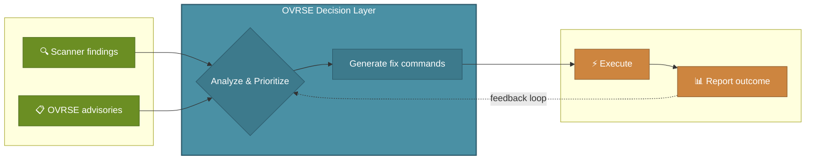
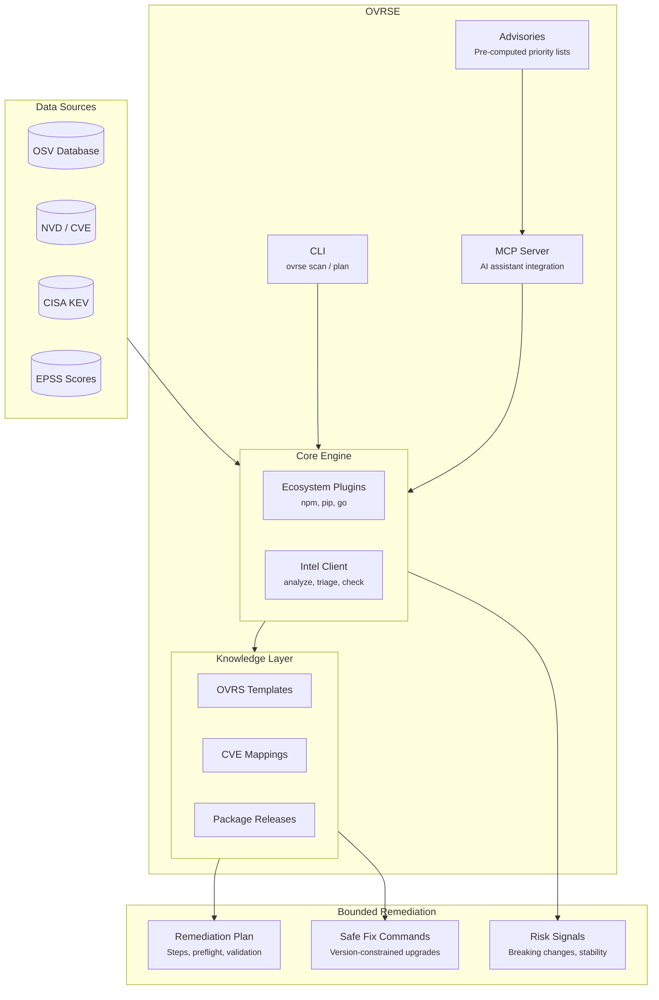

<p align="center">
  
</p>

<h1 align="center">OVRSE</h1>

<p align="center">
  <strong>The open remediation layer for AI tools, so they fix vulnerabilities safely instead of running blind upgrades</strong>
</p>

<p align="center">
  <a href="LICENSE"></a>
  <a href="https://github.com/emphereio/ovrse/releases"></a>
  <a href="https://pkg.go.dev/github.com/emphereio/ovrse"></a>
</p>

<p align="center">
  <a href="#why">Why</a> •
  <a href="#problem">Problem</a> •
  <a href="#solution">Solution</a> •
  <a href="#ai-integration">AI Integration</a> •
  <a href="#cli">CLI</a> •
  <a href="#architecture">Architecture</a> •
  <a href="#contributing">Contributing</a>
</p>

---

<p align="center">
  <a href="https://www.loom.com/share/4cd7882e1dfe4891a2c93bfabc82f82a">
    
  </a>
</p>

---

## Why OVRSE Exists
<a id="why"></a>

Your scanner found 47 vulnerabilities. Now what?

You start researching. The first CVE says "upgrade to 4.17.21." But 4.19.0 is available. Is that better? Safer? Does it introduce new issues? The GitHub release notes mention "breaking changes in 4.18" but not which ones. The NVD page links to a PR that was reverted. Someone on Reddit says the patch caused memory leaks. The maintainer closed the issue without commenting.

That was one CVE. You have 46 more.

The questions pile up:

- *"What's the least breaking version that actually fixes this?"*
- *"Is this patch stable, or are people reporting issues?"*
- *"Scanner says upgrade to 2.3.4, but 2.5.0 exists. Is it safe?"*
- *"What's the actual command? npm? yarn? pnpm?"*
- *"Which of these 47 are actually being exploited right now?"*

Enterprise teams pay for tools that answer these questions. Everyone else has browser tabs and Friday nights.

**Scanners find vulnerabilities. They don't fix them.**

---

## The Problem
<a id="problem"></a>

Now AI is doing vulnerability remediation too. Faster than any human, but with the same blind spots.

When you point an AI agent at a CVE, it does the obvious thing: upgrade to latest and move on. That's dangerous.

- **Latest isn't always safe.** The newest version may introduce breaking changes, have reported instability, or pull in new CVEs.
- **"Upgrade" isn't one decision.** There are often 3+ candidate versions. Picking the wrong one means shipping risk to clear a dashboard.
- **AI doesn't know your constraints.** Change windows, reboot requirements, dependency chains, and ecosystem-specific quirks are not in the CVE advisory.

AI moves faster than humans but makes the same mistakes. Without guardrails, every remediation is a guess executed at machine speed.

**OVRSE is the guardrail.**

---

## How OVRSE Solves It
<a id="solution"></a>

OVRSE is the layer between "you have a CVE" and "someone runs a command." It provides bounded remediation decisions so AI agents and humans can fix vulnerabilities within clear constraints.

### Scanner In, Advisory-Guided Loop Out

OVRSE does not replace scanners. It consumes findings from your existing scanner and ecosystem tools, then combines them with OVRSE advisories to decide what matters now and how to fix it safely.

**Scanner findings tell you what exists. Advisories tell you what's urgent. OVRSE turns both into safe execution.**



### What OVRSE Controls

| Boundary | What It Does |
|----------|--------------|
| **Version selection** | Recommends the least risky version that actually fixes the CVE, not just "latest" |
| **Stability signals** | Aggregates community reports, maintainer activity, and regression data before recommending |
| **Risk thresholds** | Weighs CISA KEV (actively exploited), EPSS (exploit probability), and CVSS to prioritize what matters |
| **Breaking change warnings** | Flags known breakage between current and target versions before any upgrade runs |
| **Ecosystem-aware commands** | Generates the exact fix command for your package manager (npm, pip, go) |
| **Verification steps** | Provides preflight checks and post-fix validation so upgrades don't ship blind |

### What OVRSE Is

- **A remediation intelligence and guardrails layer**: the decision engine for safe vulnerability fixes
- **An MCP server**: AI assistants (Claude, Cursor, Windsurf) call OVRSE for bounded remediation guidance
- **A CLI**: humans get the same intelligence for manual workflows and CI/CD pipelines
- **An open specification (OVRS)**: structured remediation knowledge that both AI and humans can consume
- **Intelligence from multiple sources**: NVD, OSV, GitHub, CISA KEV, EPSS, package registries, and community signals

### What OVRSE Is NOT

- **Not a primary scanner.** OVRSE supports pluggable ecosystem adapters and integrates with existing scanner outputs. It sits downstream of detection.
- **Not a vulnerability database.** We consume OSV, NVD, vendor feeds.
- **Not an orchestration layer.** No rollout strategies or fleet management. OVRSE tells you *what* to do and *why it's safe*, not *when to deploy it*.

---

## AI Integration (MCP)
<a id="ai-integration"></a>

OVRSE is built for AI workflows. The primary interface is the **MCP (Model Context Protocol) server**, which gives assistants bounded access to remediation intelligence.

**Instead of this:**
> AI: *"There's a vulnerability in lodash. Upgrading to latest."*
> `npm install lodash@latest` ← unverified, potentially breaking

**You get this:**
> AI + OVRSE: *"lodash 4.17.15 has 2 CVEs. Safest fix is 4.17.21. It is a minimal patch with no known breaking changes. 4.19.0 exists but has reported regressions."*
> `npm install lodash@4.17.21` ← bounded, informed, safe

### Remote MCP (Zero Setup)

Connect directly to the hosted server. No installation required.

```json
{
  "mcpServers": {
    "ovrse": {
      "url": "https://mcp.emphere.dev/mcp/"
    }
  }
}
```

**Then ask your AI assistant:**

- *"Scan my project for vulnerabilities"*
- *"Is lodash 4.17.15 affected by any CVEs? What's the fix?"*
- *"Triage these CVEs by risk: CVE-2024-1234, CVE-2024-5678"*
- *"What breaks if I upgrade axios to 1.6.0?"*

### Local MCP (Privacy and Offline)

Run your own MCP server for full privacy and air-gapped environments.

**1. Install ovrse:**
```bash
go install github.com/emphereio/ovrse/cmd/ovrse@latest
```

**2. Add to Claude Code config** (`~/.claude.json`):
```json
{
  "mcpServers": {
    "ovrse": {
      "command": "ovrse",
      "args": ["mcp"]
    }
  }
}
```

### MCP Tools

| Tool | What It Does |
|------|--------------|
| `scan_project` | Scan a directory for vulnerabilities across all ecosystems |
| `check_if_affected` | Check if a specific package version is vulnerable |
| `analyze_cve` | Full analysis: fix commands, breaking changes, stability |
| `get_cve_verdict` | Quick risk assessment for prioritization |
| `batch_triage` | Triage multiple CVEs, sorted by risk |
| `get_fix` | Get the exact bounded upgrade command for a package |
| `list_ecosystems` | List available ecosystem plugins (npm, pip, go, etc.) |
| `report_remediation_outcome` | Report fix success/failure for community feedback loop |

---

## CLI
<a id="cli"></a>

For manual workflows, CI/CD pipelines, and teams not yet using AI assistants, you get the same intelligence and boundaries.

### Installation

```bash
# With Go (recommended)
go install github.com/emphereio/ovrse/cmd/ovrse@latest

# Or build from source
git clone https://github.com/emphereio/ovrse.git
cd ovrse && make build
./bin/ovrse --version
```

### Scan for Vulnerabilities

```bash
# Auto-detects npm, pip, go from lock files
ovrse scan ./my-project

# JSON output for CI/CD pipelines
ovrse scan --json ./my-project
```

```
[npm] Scanned 2 packages
  [?] lodash@4.17.15 - GHSA-29mw-wpgm-hmr9
  [?] lodash@4.17.15 - GHSA-35jh-r3h4-6jhm
  [?] axios@0.21.0 - GHSA-4w2v-q235-vp99

Total: 2 packages, 3 vulnerabilities
```

### Generate Remediation Plans

```bash
ovrse plan --cve CVE-2024-1234 \
  --os-family debian --distribution debian \
  --release 12 --arch amd64 \
  --package nginx --version 1.22.0 \
  --explain
```

See [CLI Reference](docs/CLI_REFERENCE.md) for full documentation.

---

## Architecture
<a id="architecture"></a>



### Entry Points

| Entry Point | Best For |
|-------------|----------|
| **MCP Server** | AI agents that need bounded remediation decisions |
| **CLI** | Humans, CI/CD pipelines, scripting |
| **Advisories** | Pre-computed CVE lists for monitoring dashboards |

### Data Flow

1. **Scanners and ecosystem tools** identify vulnerabilities in your codebase.
2. **OVRSE advisories** add forward-looking urgency by ecosystem.
3. **OVRSE** provides remediation intelligence within defined boundaries:
  - Which version is the safest fix? (not just latest)
  - What's the exact upgrade command?
  - Are there breaking changes?
  - Is the fix stable? What are people reporting?
  - Is this CVE actively exploited?
4. **AI or human** executes with confidence using guidance that is informed, constrained, and verifiable.

---

## The OVRS Specification

OVRSE is powered by the **Open Vulnerability Remediation Specification (OVRS)**, a structured format for describing *how* to fix vulnerabilities, not just that they exist.

OVRS is what makes remediation knowledge portable. It's the reason an AI agent and a human running the CLI get the same bounded, high-quality guidance.

See [spec/README.md](spec/README.md) for the full specification.

---

## Supported Ecosystems

| Ecosystem | Package Managers | Lock Files |
|-----------|------------------|------------|
| **npm** | npm, yarn, pnpm | `package-lock.json` |
| **Python** | pip, poetry, pipenv | `requirements.txt` |
| **Go** | go modules | `go.sum` |

**Coming soon:** Maven, Cargo, RubyGems, NuGet

The plugin architecture makes adding ecosystems straightforward. See [pkg/ecosystem/](pkg/ecosystem/) for examples.

---

## Advisories

Pre-computed, risk-prioritized CVE lists updated every 4 hours.

```bash
curl -s https://raw.githubusercontent.com/emphereio/ovrse/main/advisories/npm.json | jq '.cves[:3]'
```

**Gating criteria**: a CVE is included if it meets any of:
- Listed in CISA KEV (actively exploited)
- EPSS percentile ≥ 50%
- CVSS score ≥ 9.0

**Available ecosystems:**
[npm](advisories/npm.json) •
[pypi](advisories/pypi.json) •
[go](advisories/go.json) •
[maven](advisories/maven.json) •
[cargo](advisories/cargo.json) •
[gem](advisories/gem.json) •
[global](advisories/global.json)

See [advisories/README.md](advisories/README.md) for schemas and usage.

---

## Project Status

### What Works
- CLI: `scan`, `mcp`, `validate`, `plan`, `plan-host` commands
- MCP server with 8 tools for AI assistants
- Ecosystem plugins: npm, pip, Go
- Pre-computed advisories (6 ecosystems)
- OVRS specification (templates, KB, extensions)

### What's Next
- More ecosystem plugins (Maven, Cargo, NuGet)
- Template library expansion
- JSON Schema validation
- Integration guides for execution engines

See [ROADMAP.md](docs/ROADMAP.md) for details.

---

## Documentation

| Document | Description |
|----------|-------------|
| [CLI Reference](docs/CLI_REFERENCE.md) | Complete command documentation |
| [Project Overview](docs/OVRSE_OVERVIEW.md) | Architecture, data flow, concepts |
| [OVRS Specification](spec/README.md) | Template and KB format |
| [Advisories](advisories/README.md) | Pre-computed CVE lists |
| [Roadmap](docs/ROADMAP.md) | Development plans |

---

## Contributing
<a id="contributing"></a>

We welcome contributions!

- **Report a bug** → [Open an issue](https://github.com/emphereio/ovrse/issues/new?template=bug_report.md)
- **Request a feature** → [Open an issue](https://github.com/emphereio/ovrse/issues/new?template=feature_request.md)
- **Add an ecosystem plugin** → See [pkg/ecosystem/](pkg/ecosystem/)
- **Improve templates** → PRs to `examples/templates/`
- **Fix documentation** → PRs welcome

See [CONTRIBUTING.md](CONTRIBUTING.md) for guidelines.

---

## Security

For security vulnerabilities, see [SECURITY.md](SECURITY.md).

---

## License

Apache 2.0. See [LICENSE](LICENSE).

---

<p align="center">
  <sub>Built by <a href="https://emphere.com">Emphere</a></sub>
</p>
