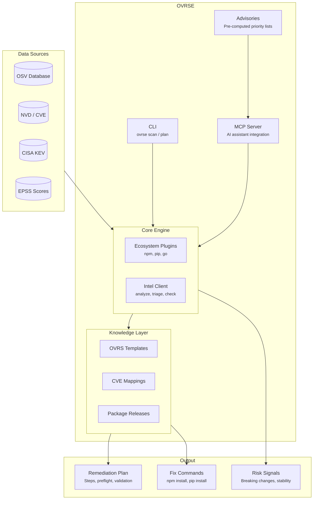

<p align="center">
  
</p>

<h1 align="center">OVRSE</h1>

<p align="center">
  <strong>The open remediation layer for vulnerability management</strong>
</p>

<p align="center">
  <a href="LICENSE"></a>
  <a href="https://github.com/emphereio/ovrse/releases"></a>
  <a href="https://pkg.go.dev/github.com/emphereio/ovrse"></a>
</p>

<p align="center">
  <a href="#why-ovrse-exists">Why</a> •
  <a href="#use-with-ai-assistants">AI Integration</a> •
  <a href="#command-line-interface">CLI</a> •
  <a href="#how-it-works">Architecture</a> •
  <a href="#contributing">Contributing</a>
</p>

---

<p align="center">
  <a href="https://www.loom.com/share/4cd7882e1dfe4891a2c93bfabc82f82a">
    
  </a>
</p>

---

## Why OVRSE Exists

The industry is very good at one half of the problem:

- We can **find** vulnerabilities (Trivy, Grype, Snyk, Wiz, cloud scanners...)
- We can **name** them (CVE, NVD, CISA KEV, vendor advisories)
- We can **track** them (Jira, ServiceNow, spreadsheets)

But when someone asks a simple question:

> *"For this CVE, on this system, what exactly should we do to fix it, how safe is that change, and what else will it fix?"*

...the real answer usually lives in:

- A wiki page that's out of date
- A one-off script in a random repo
- Someone's personal memory
- Scanner-specific "fix" text that isn't reusable

**OVRSE exists to give that answer a shared, portable shape.**

### What OVRSE Is

- **An open specification (OVRS)** for describing *how* to fix vulnerabilities
- **A reference CLI** for scanning, planning, executing, and verifying fixes
- **An MCP server** for AI-assisted remediation (Claude, Cursor, Windsurf)
- **Pre-computed advisories** with risk prioritization (KEV, EPSS, CVSS)
- **A pluggable ecosystem** for extending to any package manager

### What OVRSE Is NOT

- **Not a scanner** — Use existing tools (Trivy, Grype, Snyk). We sit downstream. We include lightweight lockfile scanning for convenience, but our focus is remediation intelligence.
- **Not a vulnerability database** — We consume OSV, NVD, vendor feeds.
- **Not an orchestration layer** — No rollout strategies, approval workflows, or fleet management.

---

## Use with AI Assistants

OVRSE is built AI-forward. The fastest way to use it is through the **MCP (Model Context Protocol)** server, which integrates with Claude, Cursor, Windsurf, and other AI assistants.

### Remote MCP — Zero Setup

Connect directly to the hosted MCP server. No installation required.

**Add to your Claude Desktop or Cursor config:**

```json
{
  "mcpServers": {
    "ovrse": {
      "url": "https://mcp.ovrse.dev"
    }
  }
}
```

**Then ask your AI assistant:**

- *"Scan my project for vulnerabilities"*
- *"Is lodash 4.17.15 affected by any CVEs? What's the fix?"*
- *"Triage these CVEs by risk: CVE-2024-1234, CVE-2024-5678"*
- *"What breaks if I upgrade axios to 1.6.0?"*

The AI reads your local context and returns personalized remediation guidance with fix commands, breaking change warnings, and stability signals.

### Local MCP — Privacy & Offline

Run your own MCP server for full privacy and offline scanning.

```bash
# Install
go install github.com/emphereio/ovrse/cmd/ovrse@latest

# Start MCP server
ovrse mcp
```

**Configure your client for local server:**

```json
{
  "mcpServers": {
    "ovrse": {
      "command": "ovrse",
      "args": ["mcp"]
    }
  }
}
```

### MCP Tools

| Tool | What It Does |
|------|--------------|
| `scan_project` | Scan a directory for vulnerabilities across all ecosystems |
| `check_if_affected` | Check if a specific package version is vulnerable |
| `analyze_cve` | Full analysis: fix commands, breaking changes, stability |
| `get_cve_verdict` | Quick risk assessment for prioritization |
| `batch_triage` | Triage multiple CVEs, sorted by risk |
| `get_fix` | Get the exact upgrade command for a package |
| `list_ecosystems` | List available ecosystem plugins (npm, pip, go, etc.) |
| `report_remediation_outcome` | Report fix success/failure for feedback loop |

---

## Command Line Interface

For direct usage without AI assistants, OVRSE provides a full CLI.

### Installation

```bash
# With Go (recommended)
go install github.com/emphereio/ovrse/cmd/ovrse@latest

# Or build from source
git clone https://github.com/emphereio/ovrse.git
cd ovrse && make build
./bin/ovrse --version
```

### Scan for Vulnerabilities

```bash
# Auto-detects npm, pip, go from lock files
ovrse scan ./my-project

# JSON output for CI/CD pipelines
ovrse scan --json ./my-project
```

**Example output:**

```
[npm] Scanned 2 packages
  [?] lodash@4.17.15 - GHSA-29mw-wpgm-hmr9
  [?] lodash@4.17.15 - GHSA-35jh-r3h4-6jhm
  [?] axios@0.21.0 - GHSA-4w2v-q235-vp99

Total: 2 packages, 3 vulnerabilities
```

### Generate Remediation Plans

```bash
# Plan remediation for a specific CVE
ovrse plan --cve CVE-2024-1234 \
  --os-family debian --distribution debian \
  --release 12 --arch amd64 \
  --package nginx --version 1.22.0 \
  --explain
```

See [CLI Reference](docs/CLI_REFERENCE.md) for full documentation.

---

## How It Works

OVRSE connects vulnerability data sources to remediation intelligence:



### Entry Points

| Entry Point | Best For |
|-------------|----------|
| **MCP Server** | AI-assisted remediation with Claude/Cursor/Windsurf |
| **CLI** | CI/CD pipelines, scripting, direct usage |
| **Advisories** | Pre-computed CVE lists for monitoring dashboards |

### Data Flow

1. **Scanners** detect vulnerabilities in your dependencies
2. **OVRSE** enriches with remediation intelligence:
   - Which version fixes it?
   - What's the upgrade command?
   - Are there breaking changes?
   - Is the fix stable?
3. **You decide** when and how to execute

---

## Supported Ecosystems

| Ecosystem | Package Managers | Lock Files |
|-----------|------------------|------------|
| **npm** | npm, yarn, pnpm | `package-lock.json` |
| **Python** | pip, poetry, pipenv | `requirements.txt` |
| **Go** | go modules | `go.sum` |

**Coming soon:** Maven, Cargo, RubyGems, NuGet

The plugin architecture makes it easy to add new ecosystems. See [pkg/ecosystem/](pkg/ecosystem/) for examples.

---

## Advisories

Pre-computed, risk-prioritized CVE lists updated every 4 hours.

```bash
# Get npm advisory
curl -s https://raw.githubusercontent.com/emphereio/ovrse/main/advisories/npm.json | jq '.cves[:3]'
```

**Gating criteria:** A CVE is included if it meets ANY of:
- Listed in CISA KEV (actively exploited)
- EPSS percentile ≥ 50%
- CVSS score ≥ 9.0

**Available ecosystems:**
[npm](advisories/npm.json) •
[pypi](advisories/pypi.json) •
[go](advisories/go.json) •
[maven](advisories/maven.json) •
[cargo](advisories/cargo.json) •
[gem](advisories/gem.json) •
[global](advisories/global.json)

See [advisories/README.md](advisories/README.md) for schemas and usage.

---

## Repository Structure

```
ovrse/
├── cmd/ovrse/              # CLI entry point
├── pkg/
│   ├── ecosystem/          # Plugin system (npm, pip, go)
│   ├── mcp/                # MCP server for AI assistants
│   ├── intel/              # Intel API client
│   ├── ovrs/               # OVRS template parser
│   ├── kb/                 # Knowledge base loaders
│   └── plan/               # Remediation planner
├── spec/                   # OVRS Specification → spec/README.md
├── advisories/             # Pre-computed CVE lists → advisories/README.md
├── examples/               # Example templates and KB entries
├── docs/                   # Documentation
│   ├── CLI_REFERENCE.md    # Full CLI documentation
│   ├── OVRSE_OVERVIEW.md   # Architecture deep-dive
│   └── ROADMAP.md          # Development roadmap
└── schema/                 # JSON schemas for validation
```

---

## Documentation

| Document | Description |
|----------|-------------|
| [CLI Reference](docs/CLI_REFERENCE.md) | Complete command documentation |
| [Project Overview](docs/OVRSE_OVERVIEW.md) | Architecture, data flow, concepts |
| [OVRS Specification](spec/README.md) | Template and KB format |
| [Advisories](advisories/README.md) | Pre-computed CVE lists |
| [Roadmap](docs/ROADMAP.md) | Development plans |

---

## Project Status

**Current version:** v0.2 (pre-release)

### What Works
- CLI: `scan`, `mcp`, `validate`, `plan`, `plan-host` commands
- MCP server with 8 tools for AI assistants
- Ecosystem plugins: npm, pip, Go
- Pre-computed advisories (6 ecosystems)
- OVRS specification (templates, KB, extensions)

### What's Next
- More ecosystem plugins (Maven, Cargo, NuGet)
- Template library expansion
- JSON Schema validation
- Integration guides for execution engines

See [ROADMAP.md](docs/ROADMAP.md) for details.

---

## Contributing

We welcome contributions!

- **Report a bug** → [Open an issue](https://github.com/emphereio/ovrse/issues/new?template=bug_report.md)
- **Request a feature** → [Open an issue](https://github.com/emphereio/ovrse/issues/new?template=feature_request.md)
- **Add an ecosystem plugin** → See [pkg/ecosystem/](pkg/ecosystem/)
- **Improve templates** → PRs to `examples/templates/`
- **Fix documentation** → PRs welcome

See [CONTRIBUTING.md](CONTRIBUTING.md) for guidelines.

---

## Security

For security vulnerabilities, see [SECURITY.md](SECURITY.md).

---

## License

Apache 2.0 — See [LICENSE](LICENSE).

---

<p align="center">
  <sub>Built by <a href="https://emphere.com">Emphere</a> • Open source, always</sub>
</p>
