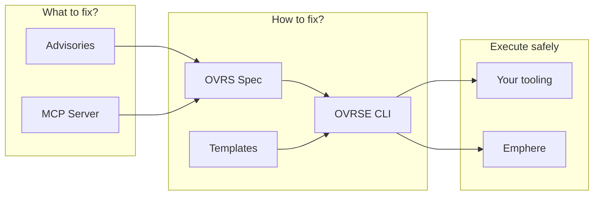

<h3 align="center">See it in action</h3>

<p align="center">
  <a href="https://www.loom.com/share/4cd7882e1dfe4891a2c93bfabc82f82a">
    
  </a>
</p>

---

<p align="center"></p>
<h1 align="center">OVRSE</h1>
<p align="center">The open remediation layer. It turns "we found a CVE" into "here is the safe fix."</p>

---

## The Problem

Security scanners generate thousands of CVE alerts. Your team faces the same questions every time:

1. **Which ones matter?** — Is this actively exploited? What's the real risk?
2. **How do I fix it?** — What's the exact upgrade path? What commands do I run?
3. **What breaks?** — Will this upgrade cause regressions? Are there breaking changes?
4. **Is the fix stable?** — Do I trust this new version, or will I regret upgrading?

Every team answers these questions privately, often incorrectly, wasting cycles on the same research.

## Why OVRSE?

Scanners tell you what's wrong. OVRSE tells you:

- **What to fix first** → Advisories prioritize by KEV, EPSS, CVSS
- **How to fix it** → Templates describe the exact steps
- **What breaks if you do** → Intelligence extensions warn about breaking changes
- **What else it fixes** → Package releases show multi-CVE remediation

The remediation knowledge layer is open because everyone needs it but most teams recreate it privately.

---

## What is OVRS?

**OVRS** (Open Vulnerability Remediation Specification) is a format for describing *how* to fix vulnerabilities—not just that they exist.

| Concept | What it does |
|---------|--------------|
| **Templates** | Reusable remediation recipes with parameterized steps |
| **CveMappings** | Link CVEs to the templates that fix them |
| **PackageReleases** | Document which package versions fix which CVEs |
| **Extensions** | Add intelligence (breaking changes, stability, exploitability) |

OVRSE is the reference implementation: CLI tools, pre-computed advisories, and a growing knowledge base.

---

## Quick Start

OVRSE powers three entry points:

### 1. Advisories — What to fix now

Pre-computed CVE priority lists by ecosystem, updated every 4 hours.

```bash
curl -s https://raw.githubusercontent.com/emphere/ovrse/main/advisories/npm.json | jq '.cves[:3]'
```

Filter by time: 7d for this week, 30d for this month. → [Browse advisories](./advisories/)

### 2. MCP Server — Ask about any CVE

Connect to Claude Code, Cursor, or any MCP-compatible client:

```
"Is my lodash affected by CVE-2020-8203? What's the fix?"
```

→ [Get the MCP server](https://emphere.com/mcp)

### 3. CLI — Generate a plan from templates

```bash
ovrse plan --cve CVE-2024-1234 --host prod-web-01
```

→ [CLI Reference](docs/CLI_REFERENCE.md)

---

## How It Fits Together



| Layer | What it does | Where |
|-------|--------------|-------|
| **Advisories** | Pre-computed CVE priority lists | [`advisories/`](./advisories/) |
| **MCP Server** | Ask about any CVE, get remediation guidance | [emphere.com/mcp](https://emphere.com/mcp) |
| **OVRS Spec** | Format for describing remediation | [`spec/`](./spec/) |
| **OVRSE CLI** | Generate plans from templates + inventory | [`cmd/`](./cmd/) |
| **Templates** | Reusable remediation recipes | [`examples/templates/`](./examples/templates/) |

---

## Documentation

| Doc | Description |
|-----|-------------|
| [Project Overview](docs/OVRSE_OVERVIEW.md) | Architecture, concepts, data flow |
| [Advisories](docs/ADVISORIES.md) | Gating thresholds, time windows |
| [OVRS Spec](spec/SPEC.md) | Templates, mappings, releases |
| [Extensions](spec/extensions-spec-v1.md) | Intelligence extensions |
| [CLI Reference](docs/CLI_REFERENCE.md) | Commands: validate, plan, plan-host |
| [Roadmap](docs/ROADMAP.md) | What's next |

---

## Project Status

OVRSE is in early days (v0.1).

**What works:**
- Core spec (templates, mappings, extensions)
- CLI with validate/plan commands
- Advisories synced every 4 hours

**What's next:**
- More templates (cloud, OS, ecosystem)
- JSON Schema validation
- Integration guides for execution engines

---

## Contributing

- **Report missing CVEs** → [Open an issue](https://github.com/emphereio/ovrse/issues/new?template=missing_cve.md)
- **Add templates** → PRs to `examples/templates/`
- **Improve the spec** → Discussion in issues first, then PR to `spec/`

See [CONTRIBUTING.md](CONTRIBUTING.md) for details.

---

## License

Apache 2.0. See [LICENSE](LICENSE).
