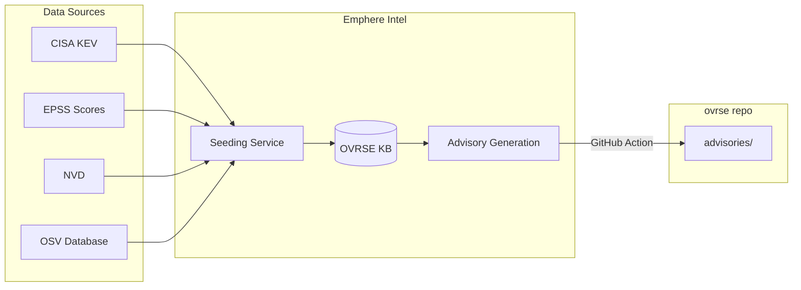
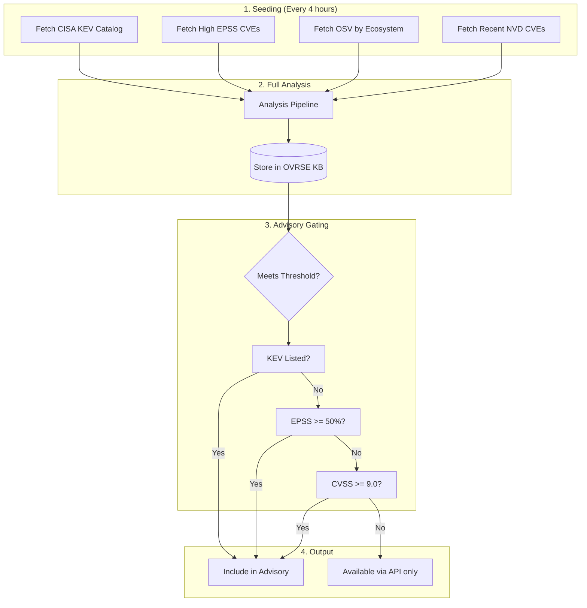
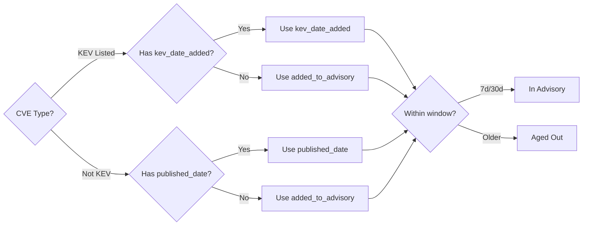

# OVRSE Advisories

Advisories provide pre-computed, risk-prioritized lists of CVEs that require immediate attention. They answer: **"What should I patch this week or this month?"**

## How Advisories Work

1. **Seeding**: CVEs are fetched from multiple sources (CISA KEV, high-EPSS, OSV, NVD)
2. **Analysis**: Each CVE is analyzed for urgency, safety, and remediation guidance
3. **Gating**: Only CVEs meeting strict thresholds are included in advisories
4. **Sync**: Advisories are synced to this repository via GitHub Actions

## Decision Flow

How does a CVE enter the advisory?

## Gating Thresholds

A CVE is included in the advisory if it meets **any** of these criteria:

| Criteria | Threshold | Rationale |
|----------|-----------|-----------|
| **KEV Listed** | Always included | Actively exploited in the wild |
| **EPSS Percentile** | >= 50% | High probability of exploitation |
| **CVSS Score** | >= 9.0 | Critical severity only |

**Philosophy**: Advisories surface "must patch immediately" scenarios. Lower-risk CVEs are available via the API on-demand.

## Time Windows

Advisories support two time windows:

| Window | Use Case |
|--------|----------|
| **7 days** | What's new this week? |
| **30 days** | Full monthly view |

The advisory JSON files contain all CVEs from the last 30 days. Filter client-side for the 7-day view.

### Timestamp Selection

Different CVE types use different timestamps for windowing:

> **Note**: All timestamp comparisons use UTC.

### Why KEV CVEs Use `kev_date_added`

An old CVE (e.g., CVE-2022-12345) newly added to KEV will appear in the 7-day window based on its KEV addition date, not its original 2022 publish date. This ensures newly-exploited old CVEs get attention.

| CVE | Published | KEV Added | Appears in 7d? |
|-----|-----------|-----------|----------------|
| CVE-2022-OLD | 2022-05-15 | 2024-02-10 | Yes (uses KEV date) |
| CVE-2024-NEW | 2024-02-08 | - | Yes (uses published date) |
| CVE-2024-OLD | 2024-01-15 | - | No (>7 days old) |

## Strict Rolling Window

All CVEs age out after 30 days. This includes KEV-listed CVEs.

> "Fix it this month or we won't remind you again."

**KEV aging**: KEV CVEs are included for 30 days from `kev_date_added`, then removed from the advisory even if still listed in the CISA KEV catalog. The full OVRSE KB retains the data; the advisory is a time-windowed view.

**Why this design**:
- Creates momentum—users must act within the window
- Keeps advisories tight and actionable (not a growing backlog)
- Users who need historical data can use the API on-demand

**Implementation note**: When CVEs are merged into an existing advisory, `added_to_advisory` is preserved for all CVEs (including KEV). This enforces the strict rolling window—CVEs cannot reset their expiry by being re-analyzed.

## Update Frequency

By default, advisories are regenerated every 4 hours and synced to this repository. The sync cadence is configurable via the GitHub Action workflow.

Each advisory file includes:
- `last_updated`: When the advisory was last regenerated
- `expires_at`: When the advisory should be considered stale

## Using Advisories

See the [advisories/README.md](../advisories/README.md) for:
- JSON schema and field reference
- Example usage with `curl` and `jq`
- How to check your dependencies against advisories

## Contributing

### Report a Missing CVE

If a critical CVE is missing:

1. Verify it meets the gating thresholds
2. [Open an issue](https://github.com/emphereio/ovrse/issues/new?labels=advisory,missing-cve)
3. Include: CVE ID, ecosystem, and why it should be included

### Report Incorrect Data

If advisory data is wrong:

1. [Open an issue](https://github.com/emphereio/ovrse/issues/new?labels=advisory,incorrect-data)
2. Include: CVE ID, what's wrong, and sources showing the correct information

### Request a New Ecosystem

To request support for a new ecosystem:

1. [Open an issue](https://github.com/emphereio/ovrse/issues/new?labels=advisory,new-ecosystem)
2. Include: ecosystem name, package manager, and vulnerability data sources
