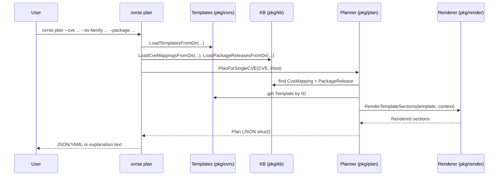

# OVRSE CLI Reference

The `ovrse` CLI is the main entry point for working with:

- OVRS templates
- The OVRSE knowledge base (KB)
- The planner

This document describes the current commands and flags.

> Note: paths and defaults below assume you run commands from the repository root.

---

## Global behaviour

- The CLI is a single binary, usually invoked as:

  ```bash
  go run ./cmd/ovrse [command] [flags]
  ```

* By default, it expects templates and KB files in:

  * Templates: `examples/templates`
  * KB: `examples/kb`

* Paths can be overridden per command with flags like `--templates-dir` and `--kb-dir`.

---

## Command: `validate`

Validate templates and KB files for structural correctness.

### Usage

```bash
ovrse validate [--templates-dir PATH] [--kb-dir PATH]
```

### Flags

* `--templates-dir PATH`  
  Directory to scan for template YAML files. Defaults to `examples/templates`.

* `--kb-dir PATH`  
  Directory to scan for KB YAML files (CveMappings and PackageReleases). Defaults to `examples/kb`.

### Behaviour

* Recursively walks `templates-dir` and `kb-dir`.
* Attempts to parse:

  * Templates into `ovrs.Template`
  * KB files into `kb.CveMapping` or `kb.PackageRelease`
* Runs `Validate()` methods on each parsed object.
* If any file fails to parse or validate:

  * Error messages are printed to stderr.
  * The process exits with a non zero exit code.
* If everything is valid:

  * Prints a success message.
  * Exits with code `0`.

### Example

```bash
go run ./cmd/ovrse validate \
  --templates-dir examples/templates \
  --kb-dir examples/kb
```

---

## Command: `plan`

Create a **plan for a single CVE on a single host**.

This is the main developer facing command right now.

### Usage

```bash
ovrse plan \
  --cve CVE-ID \
  --os-family FAMILY \
  --distribution DISTRO \
  --release RELEASE \
  --arch ARCH \
  [--package NAME] [--version VERSION] \
  [--templates-dir PATH] [--kb-dir PATH] \
  [--output json|yaml] \
  [--rendered] \
  [--explain]
```

### Required flags

* `--cve CVE-ID`  
  The CVE to plan for. Example: `CVE-2025-1234`.

* `--os-family FAMILY`  
  OS family. Example: `debian`, `rhel`.

* `--distribution DISTRO`  
  Specific distribution. Example: `debian`, `ubuntu`, `centos`.

* `--release RELEASE`  
  Distribution release or version. Example: `12`.

* `--arch ARCH`  
  Architecture. Example: `amd64`, `arm64`.

### Optional flags

* `--package NAME`  
  Package name installed on the host. Example: `nginx`.
  Used to populate the host inventory and infer `CurrentVersion` if `--version` is provided.

* `--version VERSION`  
  Installed package version on the host. Example: `1.22.0`.
  This is stored in `Host.Packages[NAME]`.

* `--templates-dir PATH`  
  Override path to template YAML files. Defaults to `examples/templates`.

* `--kb-dir PATH`  
  Override path to KB YAML files. Defaults to `examples/kb`.

* `--output json|yaml`  
  Output format for the plan object. Defaults to `json`.

* `--rendered`  
  If set, includes rendered sections in the plan output:

  * `renderedPreflight`
  * `renderedSteps`
  * `renderedValidation`

* `--explain`  
  If set, prints a **human readable summary** instead of raw JSON/YAML. When `--explain` is true, `--rendered` and `--output` are still parsed but the output is a textual explanation.

### Behaviour

1. Build a `Host` from OS flags and optional package information.
2. Load templates and KB.
3. Invoke `Planner.PlanForSingleCVE` with the CVE ID and host.
4. Planner:

   * Finds a matching `CveMapping` for this host.
   * Finds the referenced `Template`.
   * Reads target package and version from mapping parameters.
   * Consults `PackageRelease` entries to compute `FixedCVEs`.
   * Renders preflight / steps / validation into `Rendered*` sections.
5. CLI prints either the raw `Plan` as JSON/YAML or the human explanation if `--explain` is set.

### Example: raw JSON

```bash
go run ./cmd/ovrse plan \
  --cve CVE-2025-1234 \
  --os-family debian \
  --distribution debian \
  --release 12 \
  --arch amd64 \
  --package nginx \
  --version 1.22.0 \
  --rendered \
  --output json
```

Produces output similar to:

```json
{
  "cveId": "CVE-2025-1234",
  "templateId": "os.debian.package-upgrade.nginx",
  "host": {
    "id": "host-1",
    "osFamily": "debian",
    "distribution": "debian",
    "release": "12",
    "architecture": "amd64",
    "packages": {
      "nginx": "1.22.0"
    }
  },
  "parameters": {
    "serviceName": "nginx",
    "targetPackage": "nginx",
    "targetVersion": "1.24.0"
  },
  "renderedSteps": [
    {
      "id": "upgrade_package",
      "kind": "os.package_install",
      "params": {
        "package": "nginx",
        "versionConstraint": ">= 1.24.0"
      }
    }
  ],
  "targetPackage": "nginx",
  "currentVersion": "1.22.0",
  "targetVersion": "1.24.0",
  "fixedCves": [
    "CVE-2024-9999",
    "CVE-2025-1234",
    "CVE-2025-5678"
  ],
  "fixedCvesSource": "package-release"
}
```

### Example: human explanation

```bash
go run ./cmd/ovrse plan \
  --cve CVE-2025-1234 \
  --os-family debian \
  --distribution debian \
  --release 12 \
  --arch amd64 \
  --package nginx \
  --version 1.22.0 \
  --explain
```

Output:

```text
Plan for CVE-2025-1234 on host host-1

  Template:        os.debian.package-upgrade.nginx
  Target package:  nginx
  Current version: 1.22.0
  Target version:  1.24.0

  CVEs that will be fixed by this upgrade (package-release):
    - CVE-2024-9999
    - CVE-2025-1234
    - CVE-2025-5678
```

---

## Command: `plan-host`

Plan actions for a host with multiple findings. (Experimental but available.)

### Usage

```bash
ovrse plan-host \
  --host-file host.json \
  --findings-file findings.json \
  [--templates-dir PATH] [--kb-dir PATH] \
  [--output json|yaml] \
  [--explain]
```

### Required flags

* `--host-file host.json`  
  Path to a JSON file describing an `inventory.Host`.

* `--findings-file findings.json`  
  Path to a JSON array of `plan.Finding` objects:

  ```json
  [
    {"cveId": "CVE-2025-1234", "packageName": "nginx"},
    {"cveId": "CVE-2025-5678", "packageName": "nginx"}
  ]
  ```

### Optional flags

* `--templates-dir PATH`, `--kb-dir PATH`, `--output`, `--explain`  
  Same semantics as `ovrse plan`.

### Behaviour

1. Read the host and findings JSON files.
2. Load templates and KB.
3. Invoke `Planner.PlanForHostFindings` which:

   * Groups findings by package.
   * Selects a template and target version per package.
   * Computes the union of CVEs fixed by that upgrade via `PackageRelease`.
4. Outputs a `HostPlan` containing:

   * `actions`: one per package
   * `summary`: total findings, distinct CVEs fixed, number of actions

### Example: explain output

```text
Plan for host host-abc

  Total findings:      12
  Actions:             2
  Distinct CVEs fixed: 9

  Action 1:
    Template:        os.debian.package-upgrade.nginx
    Package:         nginx
    Current version: 1.22.0
    Target version:  1.24.0
    Fixed CVEs:
      - CVE-2024-9999
      - CVE-2025-1234
      - CVE-2025-5678
```

### Example: JSON input format

`host.json`

```json
{
  "id": "host-abc",
  "osFamily": "debian",
  "distribution": "debian",
  "release": "12",
  "architecture": "amd64",
  "packages": {
    "nginx": "1.22.0"
  }
}
```

`findings.json`

```json
[
  {"cveId": "CVE-2025-1234", "packageName": "nginx"},
  {"cveId": "CVE-2025-5678", "packageName": "nginx"}
]
```

Then:

```bash
go run ./cmd/ovrse plan-host \
  --host-file host.json \
  --findings-file findings.json \
  --explain
```

---

## Conceptual CLI flow



---

## Where to look in the code

* CLI entry point: `cmd/ovrse/main.go`
* Templates:
  * Definitions: `spec/template-spec-v1.md`
  * Example: `examples/templates/os.debian.package-upgrade.nginx.yaml`
* KB:
  * Definitions: `spec/kb-spec-v1.md`
  * Examples: `examples/kb/*.yaml`
* Planner: `pkg/plan/*.go`
* Renderer: `pkg/render/*.go`

If you want to add a new command, mirror how `plan`, `plan-host`, and `validate` are implemented and keep flags consistent (`--templates-dir`, `--kb-dir`, `--output`, `--explain`, etc.).
