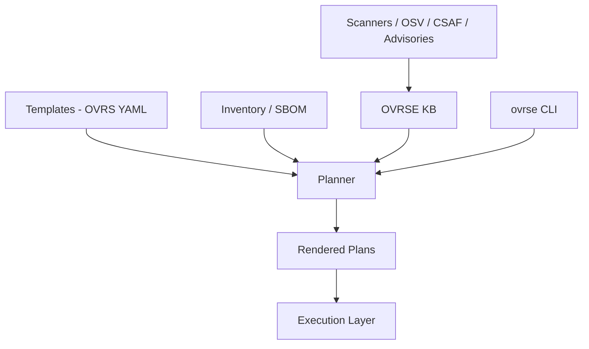

# OVRSE Project Overview

OVRSE (Open Vulnerability Remediation Service / Engine) is a small, focused project that tries to answer one question:

> Given a vulnerable system and a set of CVEs, what is the **concrete, safe, repeatable plan** to fix them?

It does not replace scanners. It does not decide what is vulnerable. It sits **downstream** of existing tools and standards such as OSV, CSAF and SBOM, and focuses on the **remediation** side:

- How do I safely upgrade this package on this host?
- What preflight checks should I perform?
- How do I validate success and roll back if needed?
- Which CVEs will this change actually fix?

OVRSE is built around three core ideas:

1. **Templates (OVRS)**  
   Reusable remediation patterns that describe *how* to fix something:
   - upgrade a package on Debian or RHEL
   - harden a security group
   - fix a storage bucket policy

2. **Knowledge Base (KB)**  
   Data that connects CVEs and package versions back to templates:
   - “CVE-2025-1234 on Debian 12 nginx can be fixed by template `os.debian.package-upgrade.nginx` with target version `1.24.0`”
   - “nginx 1.24.0 on Debian 12 fixes CVE-2025-1234, CVE-2025-5678 and CVE-2024-9999”

3. **Planner and CLI**  
   Logic that takes:
   - a host (OS, packages, SBOM)
   - a CVE or list of findings
   - templates and KB
   and produces:
   - a **rendered plan** with concrete steps
   - an explanation of which CVEs will be fixed

---

## High level data flow



* **Upstream:** scanners and vuln feeds tell us *what* is vulnerable.
* **OVRSE:** describes *how* to remediate and what the effect will be.
* **Downstream:** execution engines actually apply the changes in real environments.

---

## Core concepts (short version)

See `spec/template-spec-v1.md` and `spec/kb-spec-v1.md` for full details. This is the quick mental model.

### Template (OVRS)

A template is a YAML document that describes:

* Where it applies (`match`):

  * OS family, distribution, version range, required packages
* What parameters it needs (`parameters`):

  * package name, target version, service name, etc
* What checks to run before changing anything (`preflight`)
* Which steps to execute (`steps`)
* How to validate success (`validation`)
* How to roll back (`rollback`, optionally)
* Remediation metadata (`remediation`):

  * risk level, requires reboot, expected duration

Example:

* `os.debian.package-upgrade.nginx`
  “Upgrade nginx on Debian based hosts to a safe version with checks and rollback.”

### Knowledge Base (KB)

Two main entity types:

* `CveMapping`  
  Links a specific CVE to a template and parameter set, under certain conditions.

  Example:  
  “CVE-2025-1234 on Debian 12 nginx → template `os.debian.package-upgrade.nginx` with `targetVersion=1.24.0`.”

* `PackageRelease`  
  Describes package versions and which CVEs they fix, in a given OS context.

  Example:  
  “On Debian 12, `nginx 1.24.0` fixes CVE-2025-1234, CVE-2025-5678, CVE-2024-9999.”

The KB is populated from:

* Public data (OSV, CSAF, vendor advisories)
* Execution feedback (successful remediations observed by engines)
* Manual or community contributions

### Inventory

A simple model of a host:

* OS family, distribution, release, architecture
* Installed packages and their versions

Inventory can be derived from:

* SBOM tools (e.g. Syft)
* OS package managers
* Cloud inventory APIs

### Plan

A **plan** is what the engine returns for a given CVE + host:

* Which template is used
* Concrete parameter values
* Rendered preflight / steps / validation (placeholders resolved)
* Which CVEs this action will fix if applied

Plans are meant to be handed to an execution system, or inspected by a human.

---

## Repository layout (current)

```text
.
├── README.md
├── LICENSE
├── spec/
│   ├── README.md
│   ├── template-spec-v1.md
│   ├── kb-spec-v1.md
│   └── ovrs-architecture.md     # <— see architecture reference
├── docs/
│   ├── OVRSE_OVERVIEW.md        # <— this file
│   └── CLI_REFERENCE.md         # <— CLI reference
├── examples/
│   ├── templates/
│   │   └── os.debian.package-upgrade.nginx.yaml
│   └── kb/
│       ├── cve-mapping-nginx.yaml
│       └── package-release-nginx.yaml
└── cmd/ovrse/
    └── main.go
```

---

## How to read this project as a new engineer

1. Start with this file (`docs/OVRSE_OVERVIEW.md`) to understand intent.
2. Read:

   * `spec/template-spec-v1.md` for the template shape
   * `spec/kb-spec-v1.md` for KB entities
3. Run:

   * `go run ./cmd/ovrse validate`
   * `go run ./cmd/ovrse plan --help`
4. Inspect the example template and KB files under `examples/`.
5. Then move to the CLI reference in `docs/CLI_REFERENCE.md` and the architecture reference in `spec/ovrs-architecture.md`.

From there you should be able to add new templates, extend the planner, or build integrations.
