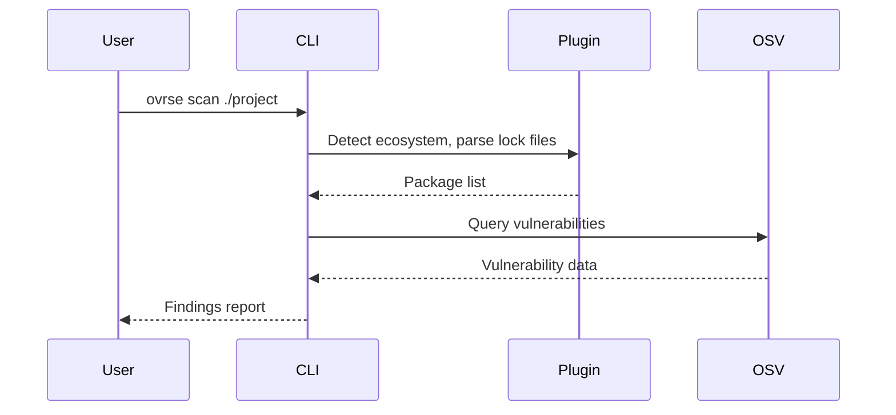
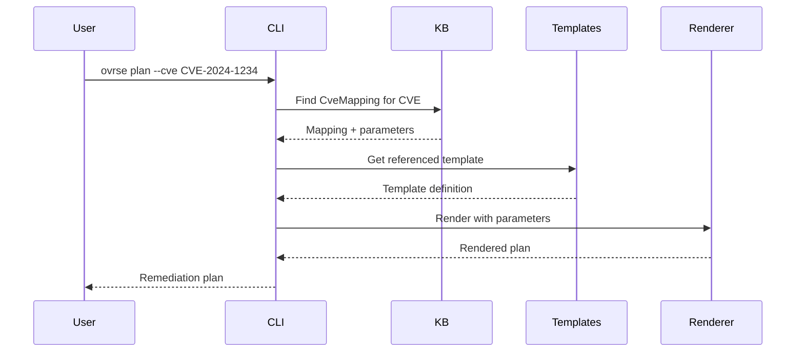

# OVRSE Project Overview

OVRSE (Open Vulnerability Remediation Service / Engine) answers one question:

> Given a vulnerability, what is the **concrete, safe, repeatable plan** to fix it?

---

## What OVRSE Does

OVRSE is designed to be **pluggable into existing scanning infrastructure**. Whether you use Trivy, Grype, Snyk, or custom tools—OVRSE connects to provide remediation intelligence:

| Input | OVRSE Provides |
|-------|----------------|
| "CVE-2024-1234 found" | Fix version, upgrade command, breaking changes |
| "Is lodash 4.17.15 vulnerable?" | Yes/no, affected ranges, fix version |
| "Triage these 10 CVEs" | Risk-sorted list with KEV/EPSS/CVSS signals |
| "Generate a fix plan" | Rendered steps, preflight checks, rollback |

---

## Architecture

OVRSE has three main layers:

```
┌─────────────────────────────────────────────────────────────────┐
│                         Entry Points                            │
├─────────────────────────────────────────────────────────────────┤
│  CLI (ovrse)          MCP Server            Advisories (JSON)   │
│  - scan               - AI assistants       - Pre-computed      │
│  - plan               - Claude/Cursor       - Risk-prioritized  │
│  - validate           - Windsurf            - 6 ecosystems      │
└─────────────────────────────────────────────────────────────────┘
                              │
                              ▼
┌─────────────────────────────────────────────────────────────────┐
│                        Core Engine                              │
├─────────────────────────────────────────────────────────────────┤
│  Ecosystem Plugins    OSV Client            Intel Client        │
│  - npm                - Vulnerability       - analyze_cve       │
│  - pip                  queries             - batch_triage      │
│  - golang             - ID resolution       - check_affected    │
│  - (extensible)       - Version ranges      - get_verdict       │
└─────────────────────────────────────────────────────────────────┘
                              │
                              ▼
┌─────────────────────────────────────────────────────────────────┐
│                     Knowledge Layer                             │
├─────────────────────────────────────────────────────────────────┤
│  OVRS Templates       Knowledge Base        Extensions          │
│  - Remediation        - CVE mappings        - Breaking changes  │
│    patterns           - Package releases    - Stability signals │
│  - Preflight/steps    - Fix versions        - EPSS/KEV data     │
│  - Validation         - Dependencies        - Regret index      │
└─────────────────────────────────────────────────────────────────┘
```

---

## Entry Points

### 1. CLI (`ovrse`)

The command-line interface for scanning and planning:

```bash
# Scan a project for vulnerabilities
ovrse scan ./my-project

# Generate a remediation plan
ovrse plan --cve CVE-2024-1234 --os-family debian ...

# Validate templates
ovrse validate --templates-dir ./templates
```

See [CLI Reference](CLI_REFERENCE.md) for full documentation.

### 2. MCP Server

AI assistant integration via Model Context Protocol:

```bash
# Start local MCP server
ovrse mcp
```

Or connect to the hosted remote MCP:

```json
{
  "mcpServers": {
    "ovrse": { "url": "https://mcp.ovrse.dev" }
  }
}
```

The MCP server exposes tools like `scan_project`, `analyze_cve`, `check_if_affected`, and `batch_triage` that AI assistants can invoke.

### 3. Advisories

Pre-computed, risk-prioritized CVE lists updated every 4 hours:

```bash
curl -s https://raw.githubusercontent.com/emphereio/ovrse/main/advisories/npm.json
```

See [Advisories README](../advisories/README.md) for schemas and usage.

---

## Core Concepts

### Ecosystem Plugins

Extensible parsers for package managers:

| Plugin | Files | Ecosystem |
|--------|-------|-----------|
| npm | `package-lock.json` | npm, yarn, pnpm |
| pip | `requirements.txt` | pip, poetry |
| golang | `go.sum` | Go modules |

Plugins implement a common interface:
- Parse lock files to extract packages
- Query OSV for vulnerabilities
- Generate fix commands for upgrades

### OVRS Templates

Reusable remediation patterns that describe *how* to fix something:

```yaml
apiVersion: ovrs/v1
kind: RemediationTemplate
metadata:
  id: os.debian.package-upgrade
spec:
  match:
    osFamily: debian
  parameters:
    - name: targetPackage
    - name: targetVersion
  preflight:
    - Check package manager is available
  steps:
    - apt-get update
    - apt-get install {{ targetPackage }}={{ targetVersion }}
  validation:
    - Verify package version matches target
```

### Knowledge Base (KB)

Data that connects CVEs to templates:

**CveMapping:** Links a CVE to a template and parameters
```yaml
apiVersion: ovrs/v1
kind: CveMapping
metadata:
  id: CVE-2024-1234-nginx
spec:
  cveId: CVE-2024-1234
  templateRef: os.debian.package-upgrade
  parameters:
    targetPackage: nginx
    targetVersion: "1.24.0"
```

**PackageRelease:** Describes which CVEs a version fixes
```yaml
apiVersion: ovrs/v1
kind: PackageRelease
metadata:
  id: nginx-1.24.0-debian12
spec:
  package: nginx
  version: "1.24.0"
  fixesCves:
    - CVE-2024-1234
    - CVE-2024-5678
```

### Intel Client

API client for remediation intelligence (breaking changes, stability, etc.):

- `analyze_cve` — Full analysis with fix commands and safety signals
- `get_cve_verdict` — Quick risk priority check
- `batch_triage` — Triage multiple CVEs sorted by risk
- `check_if_affected` — Version-specific vulnerability check

---

## Data Flow

### Scanning Flow



### Planning Flow



---

## Repository Layout

```
ovrse/
├── cmd/ovrse/              # CLI entry point
├── pkg/
│   ├── ecosystem/          # Plugin system
│   │   ├── registry.go     # Plugin registration
│   │   ├── npm/            # npm plugin
│   │   ├── pip/            # pip plugin
│   │   └── golang/         # Go modules plugin
│   ├── mcp/                # MCP server
│   │   ├── server.go       # Server setup and tool registration
│   │   └── common.go       # Shared utilities
│   ├── intel/              # Intel API client
│   │   ├── client.go       # HTTP client
│   │   └── types.go        # Request/response types
│   ├── auth/               # Authentication
│   │   ├── keypair.go      # Ed25519 key management
│   │   └── jwt.go          # JWT signing
│   ├── ovrs/               # Template parser
│   ├── kb/                 # Knowledge base loaders
│   ├── plan/               # Remediation planner
│   └── render/             # Template renderer
├── spec/                   # OVRS Specification
├── advisories/             # Pre-computed CVE lists
├── examples/               # Example templates and KB
├── docs/                   # Documentation
└── schema/                 # JSON schemas
```

---

## How to Read This Project

### As a User

1. Read the main [README](../README.md) for quick start
2. Install: `go install github.com/emphereio/ovrse/cmd/ovrse@latest`
3. Scan: `ovrse scan ./your-project`
4. For AI integration, configure MCP client

### As a Contributor

1. Read this overview to understand architecture
2. Read [CLI Reference](CLI_REFERENCE.md) for command details
3. Read [OVRS Specification](../spec/README.md) for template format
4. Look at `pkg/ecosystem/npm/` as a plugin example
5. Run tests: `make test`

### As an Integrator

1. Use the MCP server for AI assistant integration
2. Use the CLI with `--json` for machine-readable output
3. Consume advisories directly from GitHub raw URLs
4. See `pkg/intel/` for API client patterns

---

## What's Next

See [ROADMAP.md](ROADMAP.md) for development plans:

- More ecosystem plugins (Maven, Cargo, NuGet)
- Template library expansion
- JSON Schema validation
- Integration guides for execution engines
