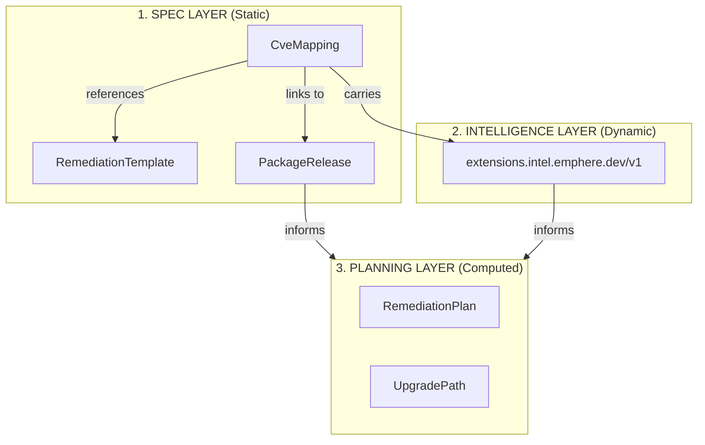
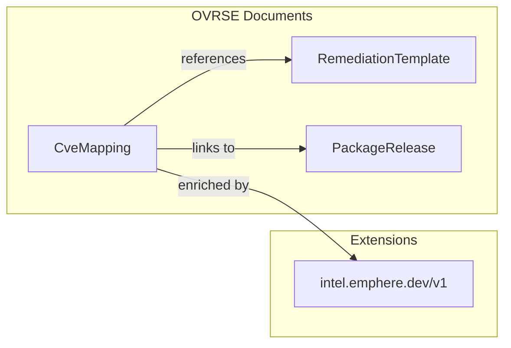
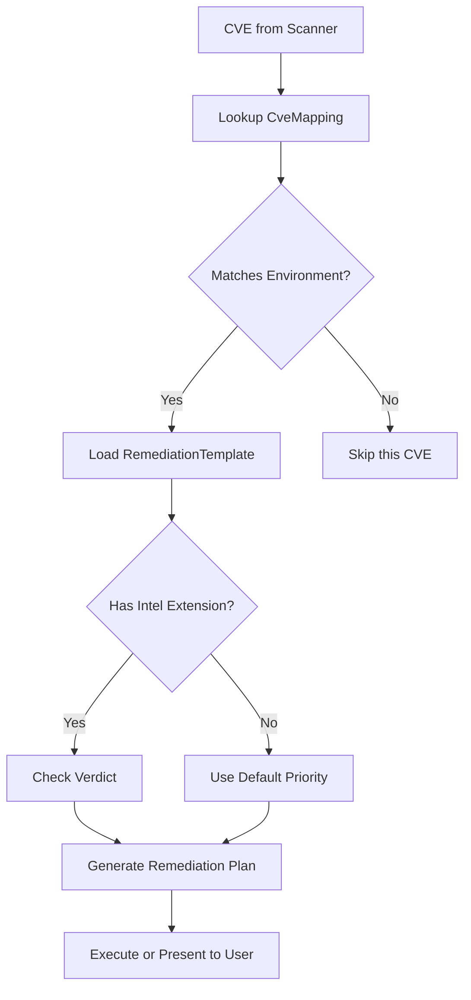
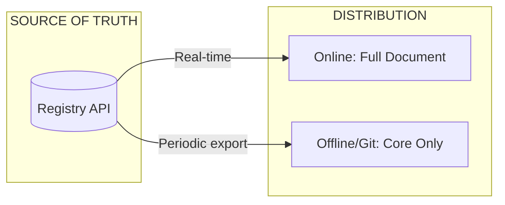

# OVRSE - Open Vulnerability Remediation Specification & Engine

OVRSE is a vendor-neutral format for describing how to remediate vulnerabilities: which changes to apply, where they are safe, and what intelligence informs the remediation decision.

This repository contains:

- The **specification** (this document and associated schemas)
- The **reference engine and content library**

## Status

OVRSE is currently in **v1.0 draft**.

## Architecture: Three Layers

OVRSE follows a layered architecture that separates concerns:



| Layer | Purpose | Persistence |
|-------|---------|-------------|
| **Spec** | Static document schemas (what, how) | Git repo, registry |
| **Intelligence** | Dynamic analysis (should you, is it safe) | Extensions on CveMapping |
| **Planning** | Computed optimal paths (SBOM → minimal commands) | Runtime output only |

**Key principle:** The spec defines shapes, intelligence links via extensions, planning is computed at runtime.

## Specification Documents

| Document | Description |
|----------|-------------|
| [template-spec-v1.md](./template-spec-v1.md) | Remediation template structure |
| [kb-spec-v1.md](./kb-spec-v1.md) | Knowledge base (CveMapping, PackageRelease) |
| [extensions-spec-v1.md](./extensions-spec-v1.md) | Extension namespaces and schemas |

## Core Document Types

OVRSE defines three main document types:



### RemediationTemplate

Parameterized remediation patterns - the "how" of remediation.

```yaml
id: "os.debian.package-upgrade"
version: "1.0.0"
summary: "Upgrade package via apt"

match:
  osFamilies: ["debian"]

parameters:
  - name: "targetPackage"
    type: "string"
    required: true

steps:
  - id: "upgrade"
    kind: "os.package_install"
    params:
      package: "{{ targetPackage }}"
```

### CveMapping

Links CVEs to templates with parameter bindings - the "what" of remediation.

```yaml
cveId: "CVE-2025-1234"
templateId: "os.debian.package-upgrade"

parameters:
  targetPackage: "nginx"
  targetVersion: "1.24.0"

applicability:
  osFamilies: ["debian"]

extensions:
  intel.emphere.dev/v1:
    verdict: "patch_immediately"
    confidence: 0.95
```

### PackageRelease

Package versions and CVE coverage - the "what fixes what" mapping.

```yaml
packageName: "nginx"
version: "1.24.0"
ecosystem: "apt"
fixesCves:
  - "CVE-2025-1234"
  - "CVE-2025-5678"
```

## Extensions

OVRSE supports namespaced extensions to attach additional metadata:

| Namespace | Description |
|-----------|-------------|
| `intel.emphere.dev/v1` | CVE intelligence (urgency, breaking changes, stability) |

See [extensions-spec-v1.md](./extensions-spec-v1.md) for the full extension specification.

## Examples

Complete examples are provided in the `examples/` directory:

- [examples/templates/](../examples/templates/) - Template examples
- [examples/kb/](../examples/kb/) - Knowledge base examples including:
  - `cve-mapping-nginx.yaml` - Basic CveMapping
  - `cve-mapping-with-intel.yaml` - CveMapping with Emphere intelligence extension
  - `package-release-nginx.yaml` - PackageRelease example

## Three Entry Points

OVRSE supports three ways to query remediation knowledge:

| Entry Point | Question | Data Used |
|-------------|----------|-----------|
| **CVE-first** | "How do I fix CVE-2021-44228?" | CveMapping → template + intel |
| **Package-first** | "What's wrong with lodash@4.17.15?" | PackageRelease → CVEs + upgrade path |
| **SBOM-first** | "Give me one plan for my lockfile" | All packages → computed optimal plan |

```mermaid
flowchart LR
    subgraph Inputs["Entry Points"]
        CVE[CVE ID]
        Pkg[Package@Version]
        SBOM[Lockfile/SBOM]
    end

    subgraph Lookup["KB Lookup"]
        CM[(CveMapping)]
        PR[(PackageRelease)]
    end

    subgraph Output["Output"]
        Plan[RemediationPlan]
    end

    CVE --> CM
    Pkg --> PR
    SBOM --> PR
    CM --> Plan
    PR --> Plan
```

### CVE-first Flow

```bash
$ ovrse intel CVE-2021-44228
```

1. Lookup `CveMapping` for the CVE
2. Return template + parameters + intelligence extension

### Package-first Flow

```bash
$ ovrse check lodash@4.17.15
```

1. Lookup `PackageRelease` for current version → get `hasCves`
2. Find newer versions → compare `fixesCves`
3. Compute optimal upgrade path with dependency changes

### SBOM-first Flow

```bash
$ ovrse plan package-lock.json
```

1. Parse all packages from lockfile
2. Batch lookup `PackageRelease` for each
3. Compute minimal set of upgrades to fix all CVEs
4. Return `RemediationPlan` (computed, not persisted)

## Resolution Algorithm



1. **Lookup**: Find CveMappings for the CVE
2. **Match**: Filter by applicability (OS, ecosystem, architecture)
3. **Template**: Load the referenced RemediationTemplate
4. **Intelligence**: Check `extensions.intel.emphere.dev/v1` for verdict and urgency
5. **Plan**: Instantiate template with parameters into a remediation plan
6. **Execute**: Run the plan or present to user for review

## Distribution Model

OVRSE documents can be distributed via different channels with different content:



| Distribution | Contains Extensions | Use Case |
|--------------|---------------------|----------|
| **Registry API** | Yes | Real-time queries, full intelligence |
| **Git repository** | No | Offline use, community contribution |
| **CLI online mode** | Yes | Calls registry API |
| **CLI offline mode** | No | Uses local Git clone |

**Why this matters:**

Extensions like `intel.emphere.dev/v1` contain dynamic intelligence (EPSS scores, breaking changes, stability analysis) that:
- Changes frequently (EPSS updates daily)
- Is computationally expensive to generate
- May be proprietary to the extension provider

By separating core documents (stable, open) from extensions (dynamic, may be proprietary), OVRSE enables:
- Community contribution to core mappings
- Proprietary value-add via extensions
- Offline operation with degraded functionality

**Implementation note:** Tools consuming OVRSE documents SHOULD handle missing extensions gracefully. If `extensions.intel.emphere.dev/v1` is not present, use default prioritization logic instead of failing.

## Versioning

- Documents specify `apiVersion` (e.g., `ovrse.dev/v1`)
- Templates specify `version` (semver for content changes)
- Extensions may have independent versions

Breaking changes result in new API versions. Backwards-compatible additions are allowed within a version.
