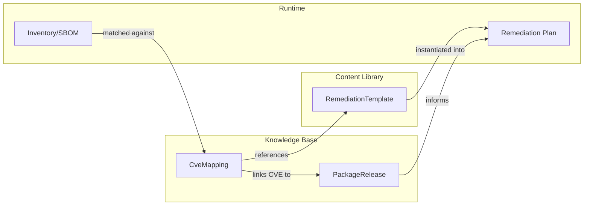

# OVRSE Knowledge Base Specification v1

> **Status:** Normative specification for the OVRSE knowledge base.

The OVRSE knowledge base (KB) connects three things:

1. Remediation templates
2. Vulnerability and advisory data
3. Package and release information

The KB does not replace existing vulnerability standards such as OSV or CSAF. Instead it sits downstream and expresses:

> "Given that this package, version and environment are vulnerable, which templates and parameters can remediate the issue, and what intelligence is available to inform the remediation decision?"

This document defines two core entities:

- `CveMapping`
- `PackageRelease`

---

## CveMapping

A `CveMapping` links a CVE to a remediation template and parameter values, under certain applicability constraints. It may also carry intelligence extensions from analysis engines.

```yaml
apiVersion: ovrse.dev/v1
kind: CveMapping

cveId: "CVE-2025-1234"

templateId: "os.debian.package-upgrade.nginx"

parameters:
  targetPackage: "nginx"
  targetVersion: "1.24.0"
  serviceName: "nginx"

applicability:
  ecosystems: ["npm", "pypi"]           # Package ecosystems (for app-level CVEs)
  osFamilies: ["debian"]                # OS families (for system-level CVEs)
  distributions: ["debian", "ubuntu"]
  architectures: ["amd64", "arm64"]

source:
  kind: "emphere-intel"
  reference: "https://intel.emphere.dev/v1/CVE-2025-1234"
  importedAt: "2025-11-22T12:00:00Z"

extensions:
  intel.emphere.dev/v1:
    verdict: "patch_with_caution"
    confidence: 0.85
    # ... see extensions-spec-v1.md for full schema
```

### Fields

#### `cveId` (required)
The CVE identifier (e.g., `CVE-2025-1234`).

#### `templateId` (required)
Reference to the remediation template to use. Format: `{namespace}.{category}.{action}.{target}`

Examples:
- `os.debian.package-upgrade`
- `os.debian.package-upgrade.nginx`
- `ecosystem.npm.package-upgrade`
- `cloud.aws.s3.bucket-harden`

For dynamically generated templates (e.g., from automated analysis), use the `emphere.generated.*` namespace:
- `emphere.generated.npm.package-upgrade`
- `emphere.generated.debian.package-upgrade`

#### `parameters` (required)
Concrete parameter values to pass when instantiating the template.

| Parameter | Type | Description |
|-----------|------|-------------|
| `targetPackage` | string | Package name to remediate |
| `targetVersion` | string | Version to upgrade to |
| `currentVersion` | string | Current installed version (optional) |
| `serviceName` | string | Service name for restart commands (optional) |

Additional parameters may be defined by specific templates.

#### `applicability` (required)
Constraints that determine when this mapping applies.

| Field | Type | Description |
|-------|------|-------------|
| `ecosystems` | string[] | Package ecosystems: `npm`, `pypi`, `maven`, `go`, `cargo`, `gem` |
| `osFamilies` | string[] | OS families: `debian`, `rhel`, `alpine`, `windows`, `macos` |
| `distributions` | string[] | Specific distributions: `debian`, `ubuntu`, `centos`, `rocky` |
| `architectures` | string[] | CPU architectures: `amd64`, `arm64`, `armv7` |

A mapping applies when the target environment matches ALL specified constraints. Empty arrays mean "any".

#### `source` (required)
Provenance information for the mapping.

| Field | Type | Description |
|-------|------|-------------|
| `kind` | enum | Source type (see below) |
| `reference` | string | URL or identifier for the source |
| `importedAt` | datetime | ISO 8601 timestamp of import/creation |

**Source kinds:**
- `osv` - Open Source Vulnerabilities database
- `nvd` - National Vulnerability Database
- `csaf` - CSAF advisory document
- `vendor-advisory` - Vendor security advisory
- `emphere-intel` - Generated by Emphere analysis
- `community` - Community contribution

#### `extensions` (optional)
Namespaced extension data. Consumers that do not understand a namespace SHOULD ignore it.

Extensions enable tools to attach additional metadata without modifying the core spec. The namespace format is a subdomain with version suffix (e.g., `intel.emphere.dev/v1`).

See [extensions-spec-v1.md](./extensions-spec-v1.md) for defined extension namespaces.

```yaml
extensions:
  intel.emphere.dev/v1:
    verdict: "patch_immediately"
    confidence: 0.95
    urgency:
      epssScore: 0.87
      kevListed: true
    # ... full schema in extensions-spec-v1.md
```

### Multiple Mappings

A single `cveId` may have multiple `CveMapping` entries for:
- Different OS families (Debian vs RHEL)
- Different ecosystems (npm vs system package)
- Different remediation strategies

A single `templateId` may appear in many `CveMapping` entries.

---

## PackageRelease

A `PackageRelease` describes a specific package version, its dependencies, and which CVEs it fixes or contains. This is the **version truth** that enables transitive analysis and multi-CVE optimization.

```yaml
packageName: "lodash"
version: "4.17.21"
ecosystem: "npm"

# OS context (for system packages only)
osFamily: "debian"
distribution: "debian"
release: "12"
architecture: "amd64"

# CVE status
fixesCves:
  - "CVE-2021-23337"
  - "CVE-2020-8203"
  - "CVE-2019-10744"

hasCves: []                             # Residual CVEs in this version

# Dependency graph (enables transitive analysis)
dependencies:
  - name: "minimist"
    version: "1.2.6"
    ecosystem: "npm"
  - name: "safer-buffer"
    version: "2.1.2"
    ecosystem: "npm"

source:
  kind: "deps-dev"
  reference: "https://deps.dev/npm/lodash/4.17.21"
  importedAt: "2025-01-28T12:00:00Z"
```

### Fields

#### `packageName` (required)
The package name as known to its package manager.

#### `version` (required)
The specific version string.

#### `ecosystem` (required)
The package ecosystem or manager: `apt`, `yum`, `apk`, `npm`, `pypi`, `maven`, `go`, `cargo`.

#### `osFamily`, `distribution`, `release`, `architecture` (conditional)
Required for OS-level packages. Describes the operating system context. Not required for ecosystem packages (npm, pypi, etc.).

#### `fixesCves` (required)
List of CVE identifiers that are fixed when upgrading TO this version.

#### `hasCves` (optional)
List of CVE identifiers that this version still contains (residual vulnerabilities).

#### `dependencies` (optional)
List of direct dependencies for this package version. Enables transitive shadow analysis.

| Field | Type | Description |
|-------|------|-------------|
| `name` | string | Dependency package name |
| `version` | string | Resolved version (not version range) |
| `ecosystem` | string | Dependency's ecosystem (usually same as parent) |

**Note:** This captures the **resolved** dependency graph, not declared version ranges. For npm, this matches what's in `package-lock.json`. For Maven, it's the resolved dependency tree.

#### `source` (required)
Provenance, same structure as `CveMapping.source`.

Additional source kinds for PackageRelease:
- `deps-dev` - deps.dev API
- `lockfile` - Parsed from lockfile (package-lock.json, poetry.lock, etc.)

### Use Cases

Planners use `PackageRelease` data to:

1. **Multi-CVE remediation**: Identify when a single upgrade fixes multiple CVEs
2. **Residual risk**: Know what CVEs remain after upgrading to a specific version
3. **Version selection**: Choose the optimal target version for a given CVE set

---

## Relationship to Templates and Inventory



**Resolution flow:**

1. From inventory, determine that a host is running `nginx` 1.22.0 on Debian 12.
2. From `PackageRelease`, determine that `nginx` 1.24.0 fixes CVE-2025-1234 and CVE-2025-5678.
3. From `CveMapping`, determine that CVE-2025-1234 on Debian can be remediated with template `os.debian.package-upgrade.nginx`.
4. Check `extensions["intel.emphere.dev/v1"]` for breaking changes, stability, and urgency signals.
5. Instantiate the template with parameters into a plan for that host.

---

## File Organization

KB documents are stored in the content directory:

```
content/
├── kb/
│   ├── mappings/
│   │   ├── CVE-2025-1234.yaml      # One file per CVE (may contain multiple mappings)
│   │   └── CVE-2025-5678.yaml
│   └── releases/
│       ├── nginx/
│       │   ├── 1.24.0-debian.yaml
│       │   └── 1.24.0-rhel.yaml
│       └── openssl/
│           └── 3.0.12-debian.yaml
└── templates/
    └── ...
```

---

## Schema Validation

JSON Schema files for validation are provided in the `schema/` directory:

- `schema/cve-mapping.schema.json`
- `schema/package-release.schema.json`

Implementations SHOULD validate documents against these schemas before use.
