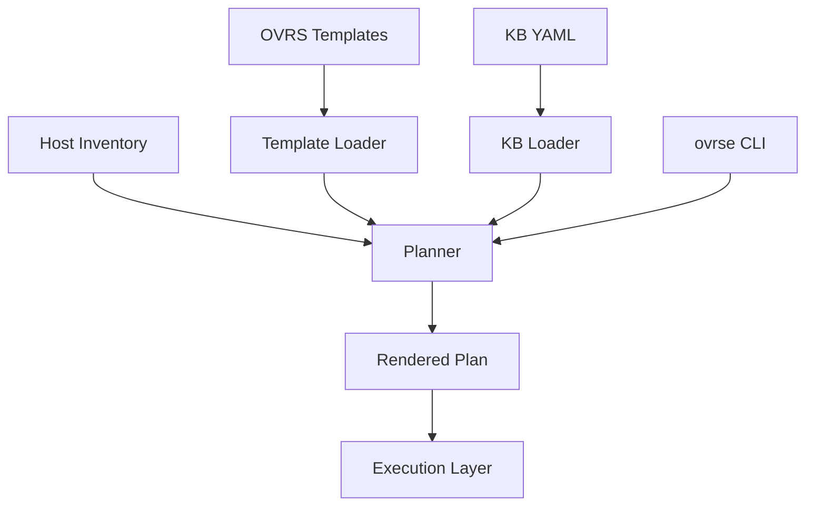
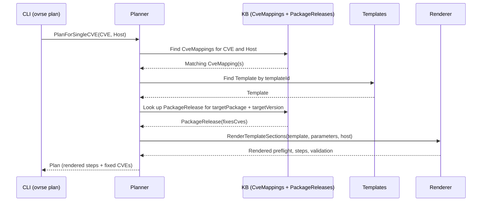

# OVRS Architecture and Reference Model

This document describes how the pieces of OVRSE fit together:

- OVRS Templates
- Knowledge Base (KB)
- Inventory
- Planner
- Renderer
- CLI

It is meant as a bridge between the higher level overview in `docs/OVRSE_OVERVIEW.md` and the more specific specs in:

- `template-spec-v1.md`
- `kb-spec-v1.md`

---

## Component view



### OVRS Templates (`pkg/ovrs`)

Templates are YAML files defined by `template-spec-v1.md` and loaded into Go structs by `pkg/ovrs`.

Key types:

* `Template`
* `TemplateMetadata`
* `MatchCriteria`
* `Parameter`
* `Check` (preflight and validation)
* `Step` (core actions)
* `Rollback`
* `RemediationHints`

Responsibilities:

* Define where the pattern applies (`match`)
* Define which parameters it needs
* Define safe preflight checks
* Define the ordered DAG of steps
* Define validation and rollback strategies

Templates **do not**:

* Carry CVE lists
* Know about specific hosts or environments
* Decide which CVEs they fix

### Knowledge Base (`pkg/kb`)

The KB is described in `kb-spec-v1.md`.

Two core types:

* `CveMapping`
* `PackageRelease`

Responsibilities:

* `CveMapping`:

  * Link `cveId` → `templateId` + parameter values
  * Specify applicability (OS family, distro, version range, arch)
  * Carry provenance (`source`)

* `PackageRelease`:

  * Describe `(osFamily, distribution, release, architecture, packageName, version)`
  * List `fixesCves` for that version
  * Carry provenance

The KB acts as a bridge between:

* External vuln/advisory data (OSV, CSAF, vendor bulletins)
* Internal knowledge learned from real remediations
* The template library

### Inventory (`pkg/inventory`)

Simplified host model:

* `OSFamily` (e.g. `debian`, `rhel`)
* `Distribution` (e.g. `debian`, `ubuntu`)
* `Release` (e.g. `12`)
* `Architecture` (e.g. `amd64`)
* `Packages` (`map[packageName]version`)

Inventory is derived from:

* SBOM tools
* Package manager queries
* Cloud APIs

OVRSE treats inventory as a **read only input**.

---

## Planner (`pkg/plan`)

The planner is the core of OVRSE.

### Single CVE planner

The current implementation provides:

* `Planner` struct:

  ```go
  type Planner struct {
      Templates       []*ovrs.Template
      CveMappings     []*kb.CveMapping
      PackageReleases []*kb.PackageRelease
  }
  ```

* `PlanForSingleCVE`:

  ```go
  func (p *Planner) PlanForSingleCVE(opts PlanOptions) (*Plan, error)
  ```

Where `PlanOptions` carries a `CVEId` and `Host`.

#### Algorithm (v1)



The planner:

1. Selects an appropriate `CveMapping` for the host.
2. Loads the referenced `Template`.
3. Extracts `targetPackage` and `targetVersion` from mapping parameters.
4. Looks up matching `PackageRelease` entries to determine which CVEs this upgrade will fix.
5. Calls the renderer to resolve placeholders.
6. Returns a `Plan`.

### Plan structure

The `Plan` type includes:

* Identity:

  * `CVEId`
  * `TemplateID`

* Context:

  * `Host` (inventory)
  * `Parameters` (template parameters)

* Template sections:

  * `Preflight`
  * `Steps`
  * `Validation`

* Rendered sections:

  * `RenderedPreflight`
  * `RenderedSteps`
  * `RenderedValidation`
  * `RenderWarnings`

* Effect on CVEs:

  * `TargetPackage`
  * `CurrentVersion`
  * `TargetVersion`
  * `FixedCVEs`
  * `FixedCVEsSource`

This allows both machines and humans to understand **how** the plan will act and **what** it will improve.

---

## Renderer (`pkg/render`)

The renderer fills in template placeholders like:

* `{{ targetPackage }}`
* `{{ targetVersion }}`
* `{{ inventory.id }}`

It works over:

* `Template.Preflight[*].Params`
* `Template.Steps[*].Params`
* `Template.Validation[*].Params`

and produces rendered copies.

### Rendering rules

* `{{ name }}` → looked up in `Parameters` map
* `{{ inventory.id }}` → `Host.ID`
* `{{ inventory.osFamily }}` → `Host.OSFamily`
* `{{ inventory.distribution }}` → `Host.Distribution`
* `{{ inventory.release }}` → `Host.Release`
* `{{ inventory.architecture }}` → `Host.Architecture`

Rendering is currently **string only**: any string value in params is scanned for `{{ ... }}` patterns and substituted.

If a placeholder cannot be resolved:

* The original string is left unchanged
* A render warning is recorded on the `Plan`

---

## CLI (`cmd/ovrse`)

The CLI is the primary interface for humans and automation to interact with OVRSE.

Commands are documented in detail in `docs/CLI_REFERENCE.md`. At a high level:

* `ovrse validate`  
  Load and validate all templates and KB files.

* `ovrse plan`  
  Given one CVE and a host description via flags, produce a plan and optional explanation.

* `ovrse plan-host`  
  (WIP) takes a host inventory and a list of findings, and collapses them into package-level actions with CVE coverage.

---

## Extending the system

To extend OVRSE, a new engineer will typically:

1. **Add or modify templates**

   * Place new YAML files under `examples/templates/` or a templates directory of choice.
   * Follow `template-spec-v1.md`.

2. **Add new KB entries**

   * Create or update `CveMapping` and `PackageRelease` YAML under `examples/kb/`.
   * Follow `kb-spec-v1.md`.

3. **Enhance the planner**

   * Implement multi-CVE / multi-package planning for a host.
   * Improve version comparison and selection logic.
   * Add support for new surfaces (cloud config, containers, etc).

4. **Integrate with a real execution layer**

   * Use the rendered plan structure to drive an agent, job system, or IaC pipeline.

When in doubt:

* Start from `docs/OVRSE_OVERVIEW.md`
* Then read this file and the two spec documents
* Then open the Go packages in `pkg/` and the CLI in `cmd/ovrse`
